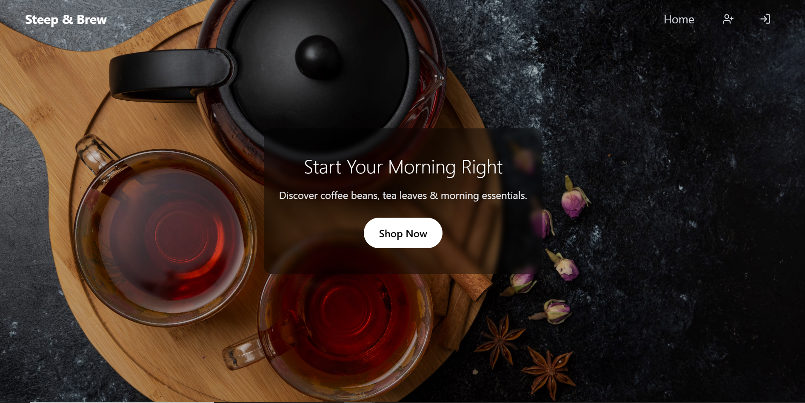
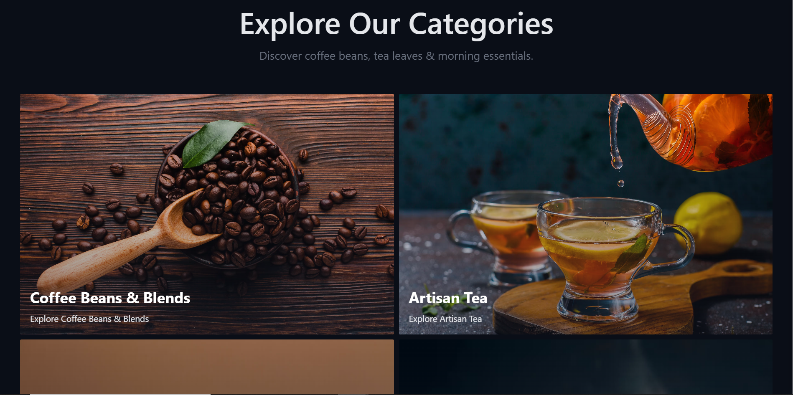
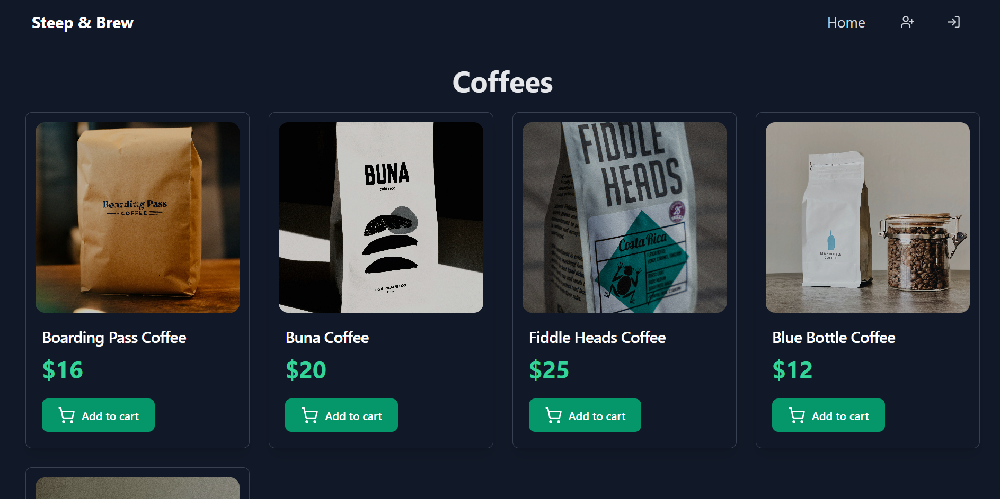
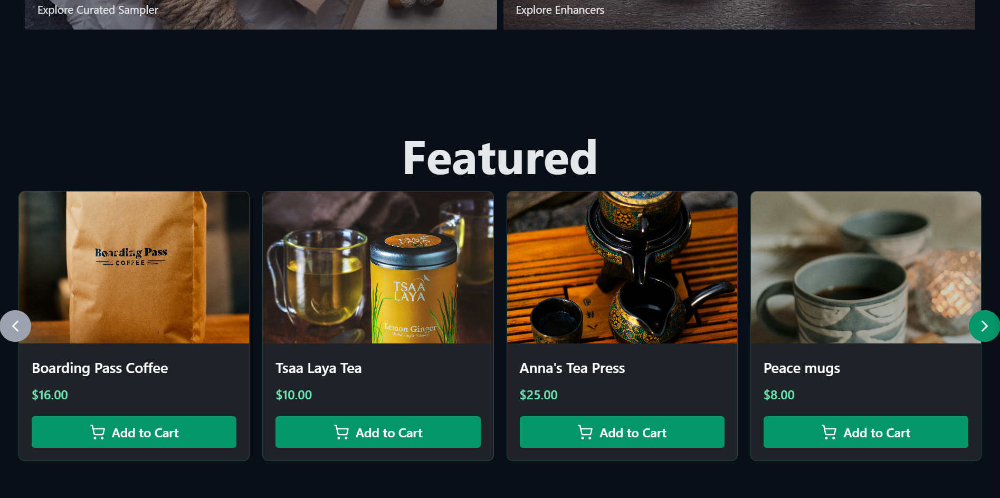
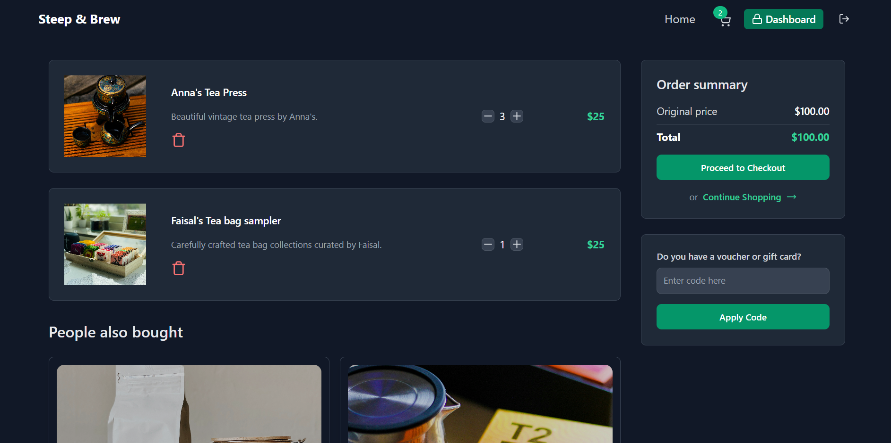
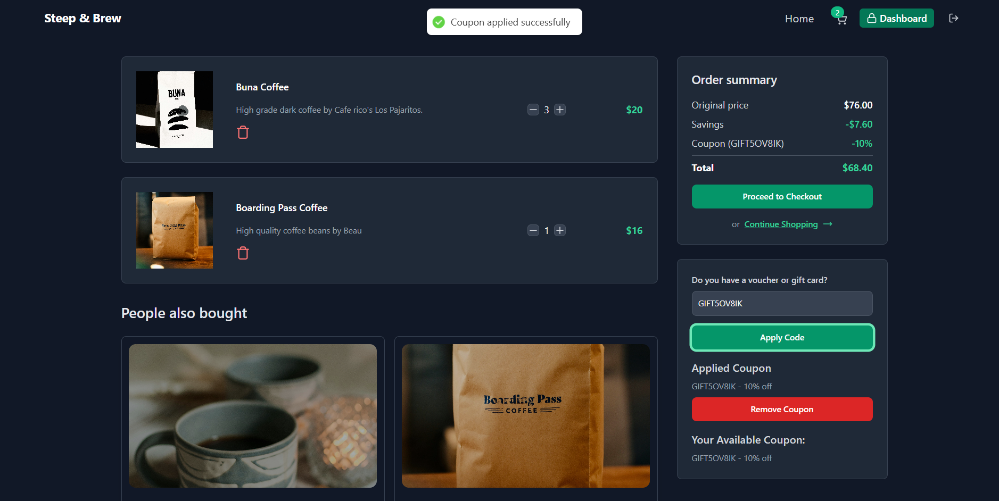
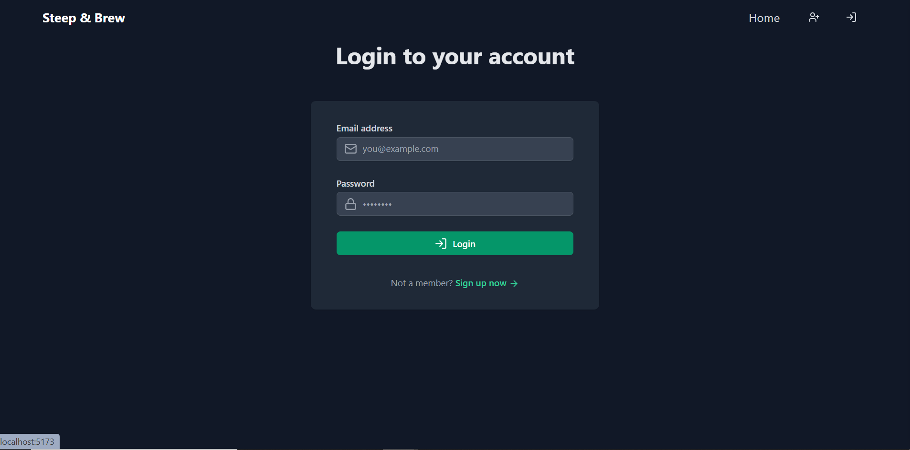
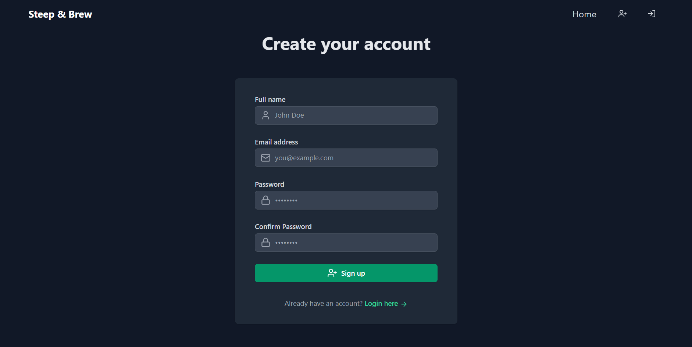

# ☕ Steep-n-Brew

Welcome to **Steep-n-Brew** — a modern full-stack eCommerce application for coffee and tea enthusiasts. This project offers a curated shopping experience for hot beverages, with an integrated admin dashboard to manage products, monitor performance, and analyze sales.

---

## Features

### Customer Experience
- Browse curated **coffee and tea** collections
- View detailed product pages with Cloudinary-hosted images
- Add products to cart and checkout securely using **Stripe**
- Mobile-friendly and responsive UI with smooth **framer-motion** animations
- Toast notifications for real-time feedback (React Hot Toast)

### Admin Dashboard
- Add, edit, and delete products
- View sales and analytics powered by **Recharts**
- Manage store inventory in real-time
- Role-based authentication with **JWT**

---

## Tech Stack

### Backend
- **Node.js** + **Express.js** – API and server setup
- **MongoDB** + **Mongoose** – NoSQL database for storing users, products, and orders
- **JWT** + **bcryptjs** – Secure authentication and password hashing
- **cookie-parser** – Manage session cookies
- **ioredis** – Redis cache layer for long/short-term data (e.g., sessions or OTPs)
- **Stripe** – Payment processing integration
- **Cloudinary** – Store and manage product images
- **dotenv** – Environment variable management

### Frontend
- **React 18** + **Vite** – Lightning-fast frontend architecture
- **Tailwind CSS** – Utility-first CSS framework for styling
- **Axios** – HTTP client for API requests
- **React Router DOM** – SPA navigation and routing
- **Zustand** – Lightweight and scalable state management
- **Framer Motion** – Smooth UI animations and transitions
- **Lucide React** – Clean and modern icons
- **Recharts** – Admin sales visualization and analytics
- **Stripe.js** – Frontend integration for secure payments
- **React Confetti** – Fun feedback on order success

---

## Screenshots

| Hero Section | Explore Categories | Category Items |
|--------------|--------------------|----------------|
|  |  |  |

| Featured Products | Cart | Coupon Implementation |
|------------------|------|------------------------|
|  |  |  |

| Login Page | Signup Page |
|------------|-------------|
|  |  |

---

## Folder Structure

```bash
steep-n-brew/
│
├── backend/
│   ├── controllers/
│   ├── models/
│   ├── routes/
│   ├── utils/
│   └── server.js
│
├── frontend/
│   ├── components/
│   ├── pages/
│   ├── stores/
│   ├── assets/
│   └── main.jsx
│
├── .env
├── package.json
└── README.md
```

## Installation
Prerequisites:
- Node.js (v18 recommended)
- MongoDB Atlas URI
- Redis instance (local or cloud-based)
- Cloudinary account
- Stripe secret & publishable keys

## Setup

```bash
git clone https://github.com/sanMakesApps/steep-n-brew.git
cd steep-n-brew
```

## Backend config

```bash
MONGO_URI=your_mongo_uri
JWT_SECRET=your_jwt_secret
CLOUDINARY_NAME=your_cloud_name
CLOUDINARY_API_KEY=your_key
CLOUDINARY_API_SECRET=your_secret
STRIPE_SECRET_KEY=your_stripe_secret
REDIS_URL=your_redis_url
```

## Install Dependencies

```bash
npm install
npm install --prefix frontend
npm run dev
```


